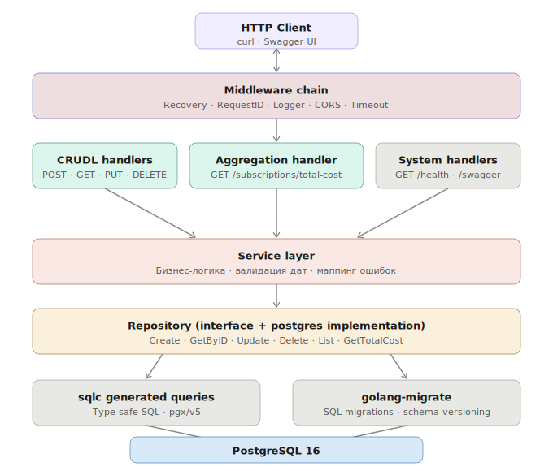
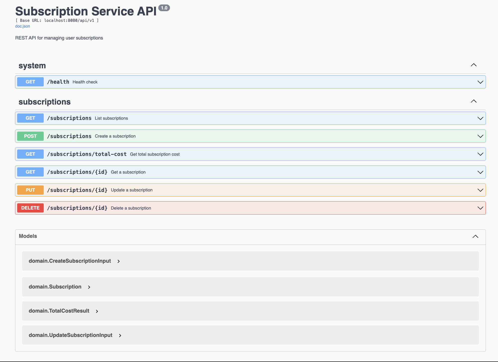

# Subscription Service

REST API для агрегации данных об онлайн-подписках пользователей.
---

## Стек

| Слой | Технология |
|---|---|
| Роутер | [Gin](https://github.com/gin-gonic/gin) |
| База данных | PostgreSQL 16 |
| Драйвер | [pgx/v5](https://github.com/jackc/pgx) |
| Генерация SQL | [sqlc](https://sqlc.dev) |
| Миграции | [golang-migrate](https://github.com/golang-migrate/migrate) |
| Swagger | [swaggo/swag](https://github.com/swaggo/swag) |
| Моки для тестов | [gomock](https://github.com/uber-go/mock) |
| Логирование | `log/slog` (stdlib, Go 1.21+) |
| Конфигурация | `godotenv` + `os.Getenv` |

---

## Архитектура



Сервис построен по классическому слоистому принципу. Каждый слой знает только о том, что находится непосредственно под ним. `main.go` — единственное место, где все зависимости собираются вместе (composition root).

Интерфейсы определяются там, где они используются, а не там, где реализованы. `service` пакет определяет `SubscriptionRepository` — реализация в `repository/postgres` об этом не знает.

---

## Быстрый старт

```bash
cp .env.example .env
make up
```

Сервис поднимается на `http://localhost:8080`.

При старте автоматически:
- поднимается Postgres
- прогоняются миграции
- стартует приложение

Swagger UI доступен по адресу `http://localhost:8080/swagger/index.html`

---

## API

### Подписки

| Метод | Путь | Описание |
|---|---|---|
| `POST` | `/api/v1/subscriptions` | Создать подписку |
| `GET` | `/api/v1/subscriptions` | Список подписок |
| `GET` | `/api/v1/subscriptions/:id` | Получить подписку по ID |
| `PUT` | `/api/v1/subscriptions/:id` | Обновить подписку |
| `DELETE` | `/api/v1/subscriptions/:id` | Удалить подписку |
| `GET` | `/api/v1/subscriptions/total-cost` | Суммарная стоимость за период |





### Пример запроса на создание

```bash
curl -X POST http://localhost:8080/api/v1/subscriptions \
  -H "Content-Type: application/json" \
  -d '{
    "service_name": "Yandex Plus",
    "price": 400,
    "user_id": "60601fee-2bf1-4721-ae6f-7636e79a0cba",
    "start_date": "07-2025"
  }'
```

Даты передаются в формате `MM-YYYY`. Поле `end_date` — опциональное.

### Подсчёт стоимости

```bash
curl "http://localhost:8080/api/v1/subscriptions/total-cost?\
period_start=01-2025&period_end=12-2025&user_id=60601fee-2bf1-4721-ae6f-7636e79a0cba"
```

Фильтрация по `user_id` и `service_name` — опциональная. Возвращает суммарную стоимость подписок, которые пересекались с указанным периодом.

---

## Команды

```bash
make up           # поднять все сервисы (postgres + migrate + app)
make down         # остановить
make down-v       # остановить и удалить volumes
make logs         # логи приложения
make test         # юнит-тесты
make test-api     # e2e тесты через curl (требует запущенного сервиса)
make lint         # golangci-lint
make fmt          # форматирование кода
make swag         # перегенерировать Swagger docs
make sqlc         # перегенерировать sqlc код
```

---

## Тесты

Юнит-тесты покрывают сервисный слой. Используется `gomock` для мокирования репозитория, все тесты — table-driven.

```bash
make test
# ok  github.com/bytepharaoh/subscription-service/internal/service
```

E2E тест прогоняет все эндпоинты через реальный HTTP:

```bash
make test-api
# PASSED: 24
# FAILED: 0
```

---

## Конфигурация

Все параметры через `.env` файл. Пример в `.env.example`.

```env
APP_ENV=development
APP_PORT=8080

DB_HOST=postgres
DB_PORT=5432
DB_USER=postgres
DB_PASSWORD=postgres
DB_NAME=subscriptions
DB_SSL_MODE=disable
```

В production переменные передаются напрямую через окружение — `.env` файл не нужен, приложение корректно продолжит работу.

---

## CI

GitHub Actions запускает три параллельных джоба на каждый push и PR в `main`:

- **lint** — `golangci-lint`
- **test** — `go test ./...`
- **build** — сборка бинаря + Docker образ (запускается только если lint и test прошли)

---

## Примечания

- Стоимость подписки — целое число рублей, копейки не поддерживаются (`INTEGER` в БД)
- Проверка существования пользователя не реализована — вне зоны ответственности сервиса
- Генерированный код (`internal/repository/db/`, `docs/`) не коммитится в репозиторий
- Docker образ весит ~18 MB (multi-stage build, runtime — `alpine:3.19`)
